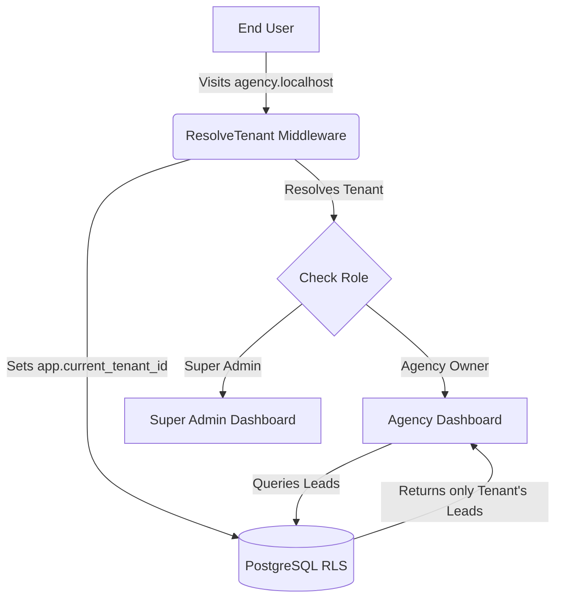

# 🤖 Multi-Agency SaaS Chatbot Platform


A high-performance, enterprise-grade multi-tenant SaaS application built for managing AI-driven customer support chatbots across multiple agencies. 

This platform allows Agency Owners to onboard, ingest custom knowledge base documents (PDFs, URLs), and embed AI chatbots into their customers' websites. It features advanced multi-tenancy, extreme database isolation via PostgreSQL Row-Level Security (RLS), and scalable Stripe billing.

---

## 📑 Table of Contents
1. [Project Overview](#-project-overview)
2. [Architecture & Multi-Tenancy](#-architecture--multi-tenancy)
3. [Features Documentation](#-features-documentation)
4. [Database & Security](#-database--security)
5. [Installation & Setup](#-installation--setup)
6. [Environment Variables](#-environment-variables)
7. [API Documentation](#-api-documentation)
8. [Queue & Background Jobs](#-queue--background-jobs)
9. [Packages & Dependencies](#-packages--dependencies)
10. [Git Workflow & Deployment](#-git-workflow--deployment)

---

## 🎯 Project Overview

- **Primary Goal:** Provide an automated, whitelabeled AI chatbot solution that marketing agencies can resell to their clients.
- **Target Audience:** Marketing Agencies, B2B SaaS Founders, Enterprise Customer Support teams.
- **Major Features:**
  - Strict Multi-Tenant Isolation (Subdomain & Custom Domain routing).
  - Knowledge Base Ingestion Pipeline (Queued jobs for document chunking/vectorization).
  - Livewire Volt-powered Onboarding Wizard and Dashboards.
  - Built-in Stripe Subscription Billing bound directly to the Agency (Tenant) model.

---

## 🏗 Architecture & Multi-Tenancy

This application leverages a highly scalable **Single Database Strategy** heavily fortified by PostgreSQL native features.

### Core Stack
- **Framework:** Laravel 13.x
- **Frontend:** Livewire 4.x (using Volt functional components) + Alpine.js + Tailwind CSS 4.x
- **Database:** PostgreSQL
- **Billing:** Laravel Cashier (Stripe)

### Multi-Tenancy Implementation
Instead of using heavy, magic packages (like `stancl/tenancy`) or a slow schema-per-tenant architecture, this platform uses a blazing-fast **Hybrid Primary Key Strategy** combined with **PostgreSQL Row-Level Security (RLS)**.

1. **Resolution:** The `ResolveTenant` middleware identifies the agency via the HTTP Host (Subdomain or Custom Domain) and binds the `tenant_id` to the Laravel service container.
2. **Isolation:** The middleware dynamically executes `SET app.current_tenant_id = ?` on the PostgreSQL connection.
3. **Database Engine Security:** RLS policies on tables (`leads`, `conversations`, `knowledge_documents`) physically block any queries that don't match the active session variable. Even if a developer forgets a `->where('tenant_id', ...)` clause, data leakage is physically impossible.
4. **Cache & Storage:** The `ResolveTenant` middleware dynamically alters the Laravel Cache prefix and Storage Disk roots to ensure files and caches are strictly siloed per tenant.

### Architecture Flow



---

## 🚀 Features Documentation

### 1. Onboarding & Registration
- **Workflow:** Users register via the `OnboardingController` or the `onboarding-wizard` Livewire component.
- **Action:** A `Tenant` is created, followed by a `User` bound to that tenant. 
- **Billing:** Triggers `CreateStripeCustomerJob` to initialize the Stripe Customer ID for the newly created Agency.

### 2. Knowledge Base Ingestion
- **Workflow:** Agency uploads PDFs or inputs URLs. 
- **Action:** Triggers the asynchronous `IngestKnowledgeJob`. This job safely restores the `tenant_id` into the queue worker using the custom `TenantAwareJob` trait to bypass container serialization issues.

### 3. Embeddable Chatbot API
- **Workflow:** Customer websites ping the `/api/chatbot/conversation/start` endpoint. The `ChatbotService` processes the query against the Tenant's vectorized knowledge base and returns the AI response.

---

## 🗄 Database & Security

### Hybrid Primary Keys
To achieve maximum indexing performance without sacrificing security, all models utilize a **Hybrid Primary Key Strategy**:
- **Internal IDs (`id`):** `BIGINT` auto-incrementing integers. Used strictly for internal Foreign Key relationships (`user_id`, `tenant_id`) to ensure lighting-fast `JOIN` performance.
- **External IDs (`uuid`):** Universally Unique Identifiers. Exposed to the frontend, APIs, and URL parameters to prevent ID enumeration attacks.

### Important Models
- `Tenant`: Represents the Agency. Implements Laravel Cashier `Billable`.
- `User`: Centralized authentication model. Belongs to a Tenant (unless Super Admin).
- `Conversation` & `ChatMessage`: Tracks end-user interactions with the AI.
- `KnowledgeDocument`: Stores references to vectorized training data.
- `Lead`: Captures generated leads from the chatbot widget.

---

## ⚙️ Installation & Setup

### Requirements
- **PHP:** >= 8.3
- **Composer:** >= 2.x
- **Node.js:** >= 20.x
- **PostgreSQL:** >= 15 (Required for RLS features)
- **Redis:** Recommended for Cache and Queues

### Setup Instructions

1. **Clone the repository:**
   ```bash
   git clone https://github.com/your-org/saas-chatbot-platform.git
   cd saas-chatbot-platform
   ```

2. **Install Dependencies:**
   ```bash
   composer install
   npm install
   ```

3. **Environment Setup:**
   ```bash
   cp .env.example .env
   php artisan key:generate
   ```

4. **Database Configuration:**
   Create a PostgreSQL database and update your `.env`:
   ```env
   DB_CONNECTION=pgsql
   DB_HOST=127.0.0.1
   DB_PORT=5432
   DB_DATABASE=saas_chatbot
   DB_USERNAME=your_db_user
   DB_PASSWORD=your_db_password
   ```

5. **Run Migrations:**
   ```bash
   php artisan migrate
   ```

6. **Create Storage Symlink:**
   ```bash
   php artisan storage:link
   ```

7. **Compile Frontend Assets:**
   ```bash
   npm run build
   ```

8. **Start Development Servers:**
   ```bash
   npm run dev
   # (In a separate terminal)
   php artisan queue:listen
   ```

---

## 🔑 Environment Variables

| Variable | Description |
|----------|-------------|
| `APP_NAME` | Name of the application (e.g., "SaaS Chatbot Platform") |
| `APP_ENV` | Environment (`local`, `staging`, `production`) |
| `APP_KEY` | Laravel encryption key |
| `APP_URL` | Base URL of the application |
| `DB_CONNECTION` | Must be `pgsql` for Row-Level Security features |
| `DB_*` | Standard PostgreSQL connection variables |
| `CACHE_STORE` | Cache driver (recommend `redis` for production) |
| `QUEUE_CONNECTION` | Queue driver (recommend `redis` for production) |
| `STRIPE_KEY` | Stripe Public Key for Cashier |
| `STRIPE_SECRET` | Stripe Secret Key |
| `STRIPE_WEBHOOK_SECRET` | Stripe Webhook signature verification |

> **Uncertainty Note:** AWS, OpenAI, or LLM-specific variables (e.g., `OPENAI_API_KEY`) were not found in the `.env.example` during the audit. You will need to add these once the LLM drivers are explicitly implemented in `ChatbotService`.

---

## 🔌 API Documentation

All chatbot interaction APIs are protected by the `api` and `tenant` middleware, ensuring that the calling domain correctly resolves to the assigned Agency.

### 1. Start Conversation
**`POST /api/chatbot/conversation/start`**
Initializes a chat session for a specific end-user on a client's website.
- **Payload:** `{ "page_url": "https://client-site.com/pricing" }`
- **Response:** `{ "conversation_id": "uuid-v4-string" }`

### 2. Send Message
**`POST /api/chatbot/message`**
Processes the user's message through the AI pipeline.
- **Payload:** `{ "conversation_id": "uuid", "message": "What is your pricing?" }`
- **Response:** `{ "reply": "Our pricing starts at $99/mo..." }`

---

## 🛠 Queue & Background Jobs

The application heavily relies on asynchronous processing for performance.

- **`IngestKnowledgeJob`**: Parses, chunks, and vectorizes large PDFs and URLs.
- **`CreateStripeCustomerJob`**: Offloads Stripe API calls during the onboarding phase to keep the registration UI blazing fast.

> [!WARNING]
> **Tenant Job Architecture:** Always use the `TenantAwareJob` trait when creating new jobs. Laravel does not automatically serialize Service Container bindings (like the resolved active tenant). This trait captures the `tenant_id` at dispatch and manually enforces the PostgreSQL RLS policy inside the Queue Worker to prevent data leaks.

---

## 📦 Packages & Dependencies

| Package | Purpose |
|----------|---------|
| `laravel/framework` (^13.8) | Core Application Framework |
| `livewire/livewire` (^4.3) | Reactive Frontend Engine |
| `livewire/volt` (^1.10) | Functional API for Livewire Components |
| `laravel/cashier` (^16.6) | Stripe Subscription Billing |
| `stripe/stripe-php` (^17.3) | Stripe SDK (Downgraded to ^17.3 for Cashier v16 compat) |
| `wireui/heroicons` | UI Iconography |
| `tailwindcss` (^4.3) | Utility-first CSS styling |

---

## 🚀 Git Workflow & Deployment

### Branching Strategy
- `main`: Production-ready code. Commits here should automatically trigger CI/CD deployment.
- `staging`: Pre-production environment for QA testing.
- `feature/*`: Individual developer branches.

### Deployment Optimization Commands
When deploying to a production Ubuntu/Forge server, ensure these commands run in your deployment script:
```bash
composer install --optimize-autoloader --no-dev
php artisan config:cache
php artisan route:cache
php artisan view:cache
npm run build
php artisan queue:restart
```

---

## 🛡 Troubleshooting & Security

### Common Issues
1. **Model Returning 0 Records in Tinker/Commands:**
   If you try to run `Lead::all()` in a console command and get 0 records, it is because PostgreSQL RLS is blocking you. You must explicitly bypass it or set a tenant context:
   ```php
   // In Tinker
   DB::statement("SET app.bypass_rls = 'on'");
   Lead::count(); // Returns actual count
   ```
2. **Volt Component ParseErrors:**
   Ensure your Blade directives (`@if`, `@foreach`) are strictly closed inside `resources/views/livewire/*.blade.php`. Unclosed directives inside Volt components will cause fatal PHP Parse errors.

### License
This software is provided "as is" without warranty of any kind. 

---
*Generated by Antigravity AI Architecture Documentation Protocol*
